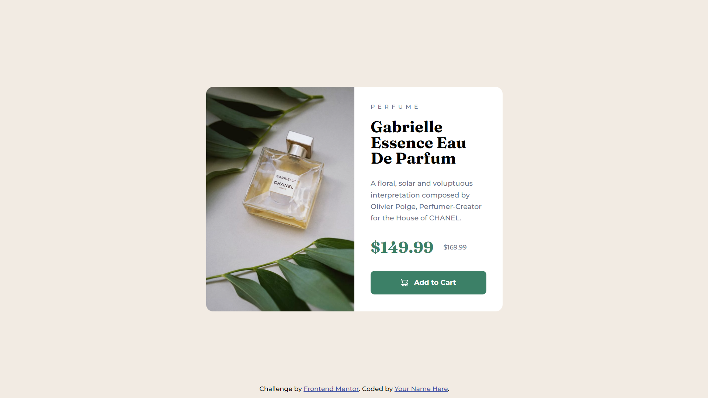

# Frontend Mentor - Product preview card component solution

This is a solution to the [Product preview card component challenge on Frontend Mentor](https://www.frontendmentor.io/challenges/product-preview-card-component-GO7UmttRfa). Frontend Mentor challenges help you improve your coding skills by building realistic projects. 

## Table of contents

- [Overview](#overview)
  - [The challenge](#the-challenge)
  - [Screenshot](#screenshot)
  - [Links](#links)
- [My process](#my-process)
  - [Built with](#built-with)
  - [What I learned](#what-i-learned)
  - [Continued development](#continued-development)
  - [Useful resources](#useful-resources)
- [Author](#author)
- [Acknowledgments](#acknowledgments)

## Overview

### The challenge

Users should be able to:

- View the optimal layout depending on their device's screen size
- See hover and focus states for interactive elements

### Screenshot



### Links

- Solution URL: [Link](https://github.com/AldrinSeanPereira/product-preview-card-component-main)
- Live Site URL: [Link](https://timely-vacherin-484227.netlify.app/)

## My process

### Built with

- Semantic HTML5 markup
- CSS custom properties
- Flexbox
- CSS Grid
- Mobile-first workflow

### What I learned

I learned that my semantic and accessibility HTML skills were lacking

If you notice my GitHub commit history for this project, you will find how I had to change all my HTML and CSS 

I also had to struggle a lot with the `picture` element which caused issues with alignment and making sure I used the correct CSS Grid concepts (for this project it seems to not be needed as much so I look forward to a future project that is more Grid heavy)

Concepts I learned:
- BEM style of naming CSS
- Accessibility in HTML and CSS (s tag, visually hidden classes, text before and after)
- CSS Grid concepts especially for alignment (justify/align of items/content)


```html
<div class="product-card__prices">
        <span class="product-card__new-price">$149.99</span>
        <s class="product-card__old-price gray-text">$169.99</s>
      </div>
```
```css
/* screen reader accessibility text */
s::before {
    content: " [strike-through start] ";
}

s::after {
    content: " [strike-through end] ";
}

/* visually hiding accessibility text so only screen readers can find it */
s::before,
s::after {
    clip-path: inset(100%);
    clip: rect(1px, 1px, 1px, 1px);
    height: 1px;
    width: 1px;
    overflow: hidden;
    position: absolute;
    white-space: nowrap;
}
```


### Continued development

Use this section to outline areas that you want to continue focusing on in future projects. These could be concepts you're still not completely comfortable with or techniques you found useful that you want to refine and perfect.

**Note: Delete this note and the content within this section and replace with your own plans for continued development.**

### Useful resources

- [The article that changed my life when creating this project](https://fedmentor.dev/posts/html-plan-product-preview/) - Everything you need + extra links are already in this. 

## Author

- LinkedIn - [Aldrin Sean Pereira](https://www.linkedin.com/in/aldrinseanpereira/)
- Frontend Mentor - [@AldrinSeanPereira](https://www.frontendmentor.io/profile/AldrinSeanPereira)
- Github - [@AldrinSeanPereira](https://github.com/AldrinSeanPereira)

## Acknowledgments

A huge THANK YOU! to the frontend mentor help section, Alex K Marshall and Grace Snow for their help.
